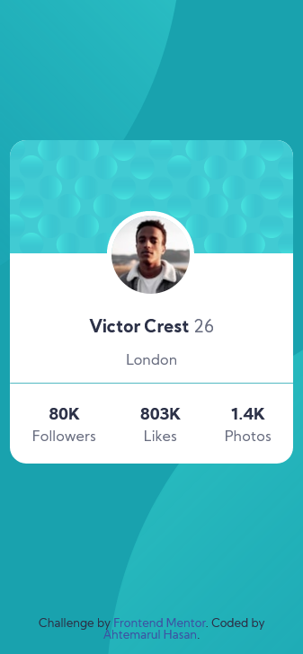

# Frontend Mentor - Profile card component solution

This is a solution to the [Profile card component challenge on Frontend Mentor](https://www.frontendmentor.io/challenges/profile-card-component-cfArpWshJ).
## Table of contents

- [Overview](#overview)
  - [Screenshot](#screenshot)
- [My process](#my-process)
- [Author](#author)

## Overview
This was just a basic project.

### Screenshot

- [Live Site URL](https://your-live-site-url.com)

### My process
Mobile first approach.

## Author

- [Github](https://github.com/Ahtemarul-Hasan)
- Frontend Mentor - [@Ahtemarul Hasan](https://www.frontendmentor.io/profile/Ahtemarul-Hasan)